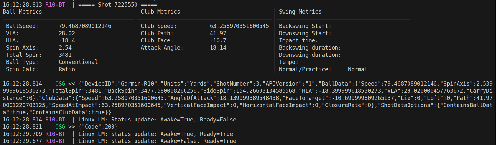

# OSG-R10-Adapter

Utility to bridge R10 launch monitor to GSPro and OpenShotGolf (OSG). Supports the following
  - Existing support from https://github.com/mholow/gsp-r10-adapter which this project is forked from. 
  - This specific project version enables Linux support for Garmin R10, and connectivity to Open Shot Golf (OSG). An open source simulator alternative to GSPro. 
  - Biggest difference is Linux uses raw output, whereas Windows used protobuf measurement data. There may be a slight difference in measurement between the two systems. 
    - One item is ball types are not identifiable on Linux side (that I know of, yet). 

## Table of Contents
- [Using Direct Bluetooth Connector](#using-direct-bluetooth-connector)
  - [Windows Bluetooth Setup](#windows-bluetooth-setup)
  - [Linux Bluetooth Support](#linux-bluetooth-support)
- [Using the Putting Integration](#using-the-putting-integration)
- [Running the Application](#running)
- [Sample Output](#sample-output)




## Using Direct Bluetooth Connector

### Windows Bluetooth Setup

To use the direct bluetooth connection on Windows:
- Enable bluetooth in `settings.json` file
- Set the `bluetooth.platform` option to `"windows"` (default)
- Edit `settings.json` to reflect your desired altitude, tee distance, temperature, etc.
- Set device in pairing mode (blue blinking light) by holding power button for few seconds
- **Pair the R10 from the Windows bluetooth settings**
  - On Windows 11 you may need to set "Bluetooth Device Discovery" to `advanced`
  - This step only needs to be done once
  - You may need to disable bluetooth on previously paired devices to prevent them from stealing the connection

### Linux Bluetooth Support

To use the direct bluetooth connection on Linux:
- Enable bluetooth in `settings.json` file
- Set the `bluetooth.platform` option to `"linux"`
- **Set the `bluetoothDeviceAddress` to your R10's MAC address** (e.g., `"F4:9D:AA:D0:05:05"`)
  - Find your R10's MAC address using `bluetoothctl` or similar tool
  - Set device in pairing mode (blue blinking light) by holding power button for few seconds
  - Scan for devices: `bluetoothctl scan on`
  - Look for "Approach R10" in the scan results
- Edit `settings.json` to reflect your desired altitude, tee distance, temperature, etc.
- The R10 must be paired with your Linux system before first use:
  ```bash
  bluetoothctl
  scan on
  # Wait for "Approach R10" to appear
  pair <MAC_ADDRESS>
  trust <MAC_ADDRESS>
  ```

**Technical Note**: The Linux implementation uses BlueZ and parses raw binary measurement data from the R10, as BlueZ does not receive the same protobuf notifications that Windows gets. Shot metrics are extracted directly from the binary packets sent by the device.


## Open Shot Golf (OSG) and Garmin R10 
This project was created to enable users to hit golf shots from Linux and use OSG. Most users today are not able to use Garmin R10 because its only supported on Windows. Usually software like GSPro, E6, etc. Now OSG exists! 


## Using the putting integration

In order to use the putting integration you must
- Enable putting in `settings.json` file
- Download ball_tracking software from https://github.com/alleexx/cam-putting-py/releases
  - If you want this program to manage opening/closing of putting camera, place ball_tracking in same folder as this program
- Read https://github.com/alleexx/cam-putting-py for webcam setup/troubleshooting
- Read putting section `settings.json` file to determine optimal settings for your setup

  - Webcam putting integration with https://github.com/alleexx/cam-putting-py


## Running

### From release

- Download either the standalone or net6 package from the release page. Extract zip to your local machine and run the exe file.
  - Use the standalone package if you are unsure whether your computer has a dotnet runtime installed
  - Use the net6 package if you believe your computer has a dotnet runtime installed.

### From Source

- Install a dotnet 9 sdk if you don't have one already
- `dotnet run` from project directory
- You can force the simulator target with `dotnet run -- --sim gspro` or `dotnet run -- --sim osg` (the `--` separates app args from dotnet)
- Without the flag, the simulator is inferred from `openConnect.port` in `settings.json` (`49152` => OpenShotGolf, `921` => GSPro)

## Sample Output

When a shot is detected, the application displays detailed ball and club metrics:

```
===== Shot 7122957 =====
Ball Metrics                            │ Club Metrics
────────────────────────────────────────┼─────────────────────────
 BallSpeed:      78.63 mph              │ Club Speed:  65.36 mph
 VLA:            39.94°                 │ Club Path:   52.31°
 HLA:            -7.81°                 │ Club Face:   4.44°
 Spin Axis:      9.71°                  │ Attack Angle: 3.42°
 Total Spin:     3661 rpm               │
 Ball Type:      Unknown                │
 Spin Calc:      Ratio                  │
────────────────────────────────────────┴─────────────────────────
```

**Metrics Explained:**
- **BallSpeed**: Initial velocity of the ball in mph
- **VLA** (Vertical Launch Angle): Upward angle of ball trajectory in degrees
- **HLA** (Horizontal Launch Angle): Left/right direction (negative = left, positive = right)
- **Spin Axis**: Tilt angle of the ball's spin axis in degrees
- **Total Spin**: Ball rotation speed in revolutions per minute
- **Ball Type**: Type of golf ball (Unknown when type cannot be determined)
- **Spin Calc**: Method used to calculate spin (Ratio, Measured, BallFlight, or Other)
- **Club Speed**: Speed of the club head at impact in mph
- **Club Path**: Direction of club movement through impact zone in degrees
- **Club Face**: Angle of club face relative to target line in degrees
- **Attack Angle**: Upward or downward angle of club head at impact in degrees
